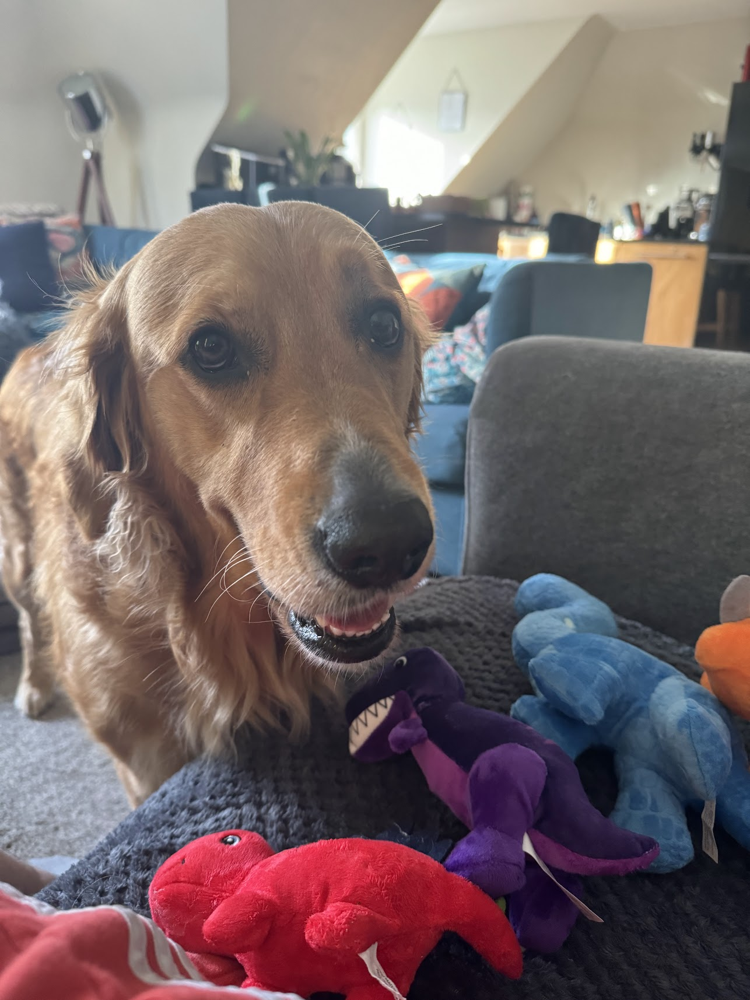

# Hugo the Golden LaunchDarkly Application



This is a Go-based web application for 'Hugo the Golden' (James' dog!) that leverages LaunchDarkly feature flags to dynamically control the content of the website. The application demonstrates how to implement feature flags, handle real-time updates with Server-Sent Events (SSE), manage concurrent access to feature flag states and additional context attributes to enable both individual targeting and rule-based targeting from within the LaunchDarkly interface. The code also includes the functionality required to build a Metric and to Measure this as part of an experimentation, however we were unable to test this without an Enterprise plan.

## Prerequisites

- Go 1.16 or later
- LaunchDarkly account and SDK key

## Getting Started

### Installation

1. Clone the repository:
    ```sh
    git clone https://github.com/yourusername/hugos-pet-shop.git
    cd hugos-pet-shop
    ```

2. Install the required dependencies:
    ```sh
    go mod tidy
    ```

### Configuration

1. Define your FeatureFlags struct in `main.go` with your own definitons:
    ```go
    // FeatureFlags holds the feature flag states with a mutex for concurrent access
    type FeatureFlags struct {
    instantRollback bool
    newShopFeature  bool
    v3Feature       bool
    ```

2. Replace the LaunchDarkly SDK key in `main.go`:
    ```go
    // Replace the SDK key with your own LaunchDarkly SDK key
    ldClient, err = ld.MakeCustomClient("YOUR_SDK_KEY", config, 10*time.Second)
    ```

3. Replace + extend the user key in `main.go` if you want to track a specific user for context and attributes:
    ```go
    // Replace "example-user-key" with your own user key
    user := ldcontext.NewBuilder("Hugo").
        SetString("firstName", "FirstName").
        SetString("lastName", "LastName").
    ```

4. Ensure your FeatureFlags match those created in the LaunchDarkly UI in `main.go`:
    ```go
    featureFlags.instantRollback, _ = ldClient.BoolVariation("instant-rollback", user, false)
    featureFlags.newShopFeature, _ = ldClient.BoolVariation("new-shop-feature", user, false)
    ```

5. Confirm your listeners are defined correctly to detect feature flag changes - these should match the above definition
    ```go
    setupListener("instant-rollback", user, func(newValue bool) {
    setupListener("new-shop-feature", user, func(newValue bool) {
    ```

6. Confirm your definition are correct for the homeHandler 
    ```go
    featureFlags.mu.RLock()
    instantRollback := featureFlags.instantRollback
    newShopFeature := featureFlags.newShopFeature
    ```

### Running the Application

1. Build and run the application:
    ```sh
    go run main.go
    ```

2. Open your web browser and navigate to `http://localhost:8080`.

3. If you want to run the V3 feature: 
    ```sh
    cd Hugo-V3
    go run main_go_hugo.go
    ```


## Application Structure

- `main.go`: The main application file that initializes the LaunchDarkly client, sets up feature flag listeners, and defines HTTP handlers.
- `Hugo-V3/main_go_hugo.go`: A variant of the main application file that provides a new context for LaunchDarkly, attributes & includes additional functionality for displaying Golden Retriever jokes when the `v3-feature` flag is enabled. It moves the joke section above the footer and centers it on the page. The joke section includes a button that, when clicked, displays a new joke from a predefined list. This file demonstrates how to dynamically update content based on feature flags and user interactions (Aligned to Metrics and Experimentation)
- `utils/kill_v3.go`:Contains utility functions, including the kill switch functionality (waiting on Enterprise licence to complete the test)
- `FeatureFlags`: A struct that holds the state of feature flags with concurrent access control.
- `sseClients`: A struct that manages the set of SSE clients.

## Feature Flags

The application uses the following feature flags which have been setup in the LaunchDarkly UI already:

1. `instant-rollback`: Controls the display of the old or new version of the homepage.
2. `new-shop-feature`: Controls the display of a Google Maps iframe showing the best dog park in the UK.
3. `v3-feature`: (Hugo-V3): Controls the display of a section with Golden Retriever jokes.

## HTTP Handlers

- `homeHandler`: Renders the homepage with content controlled by feature flags.
- `sseHandler`: Handles SSE connections to provide real-time updates to clients.

## License

This project is licensed under the MIT License. See the [LICENSE](LICENSE) file for details.

## Contributing

Contributions are welcome! Please open an issue or submit a pull request for any improvements or bug fixes.

## Contact

For questions or suggestions, please contact [James](mailto:james@hendersonmills.co.uk).